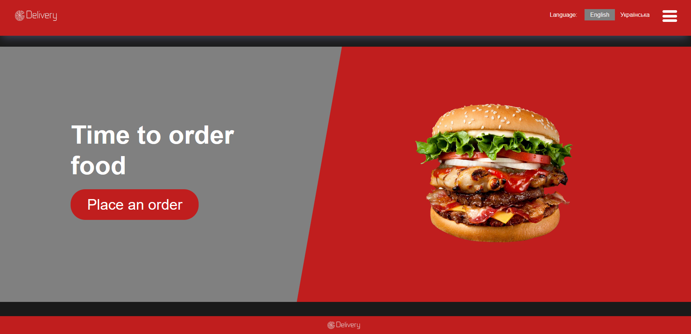
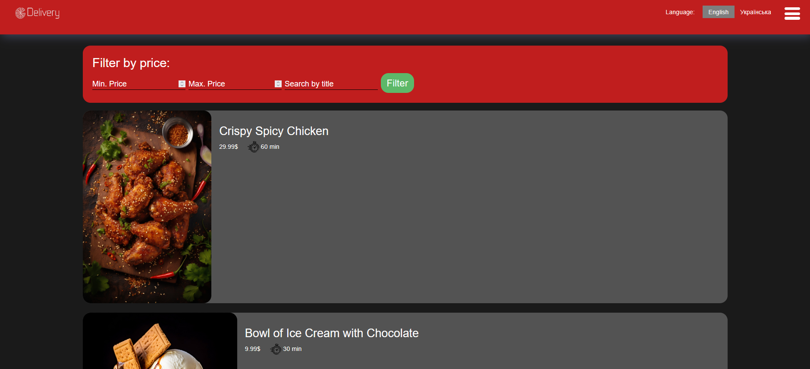
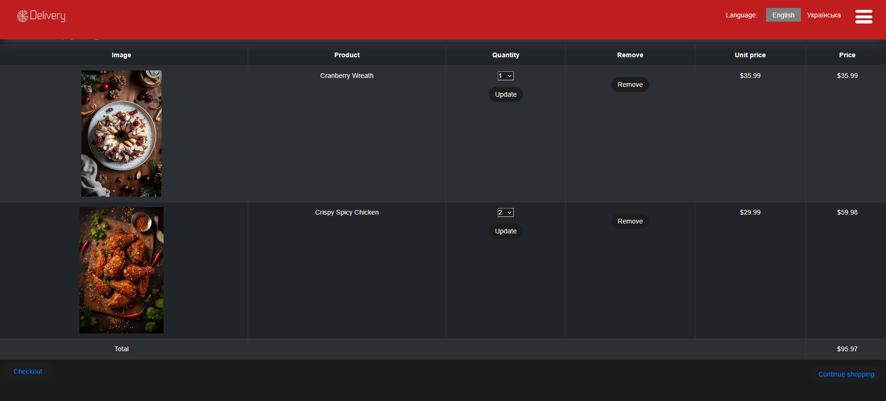
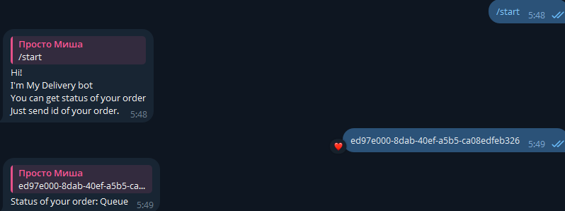
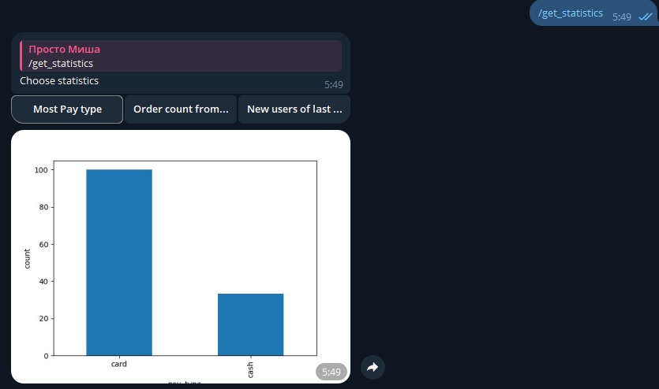

# 🥗 FoodDelivery — Django & Telegram Bot Food Ordering System

Food delivery platform built with **Django** and **Aiogram**, powered by Docker and packed with features like social authentication, order tracking via Telegram Bot, admin statistics, and seamless background tasks.



## 🚀 Features

### 🌐 Website
- 🧾 **Browse Foods** — Filter by categories, tags, or dietary preferences

- 🛒 **Shopping Cart** — Add, remove, and update your items

- 📦 **Order Management** — View your past and active orders
- 🔐 **Social Authentication** — Sign in via **Google**, **Facebook**, or **Twitter**

- ✉️ **Email Notifications**

### 🤖 Telegram Bot
- 📍 **Check Order Status** — Just send a command, get real-time updates

- 📊 **Admin Statistics**


---

## 🧰 Tech Stack

- **Django:**
- **Aiogram:**
- **Docker Compose:**
- **Nginx:**
- **Redis:**
- **Celery:**
- **PostgreSQL:**

---

## 🐳 Run project

### 📦 Prerequisites
- Docker
- Docker Compose

### 🔧 Setup Instructions

```bash
# Create .env file from template
cp .env.example .env

# Build and start all services
docker-compose up --build
```

Once everything is up and running:
- Visit the site: `http://localhost`
- Bot runs in background and connects to Telegram

---

## 🛠 Environment Variables

You'll need to set up variables for:
- Django secret key
- PostgreSQL credentials
- Redis URL
- Email backend credentials
- Telegram bot token
- Social auth keys (Google, Twitter, Facebook)

Example in `.env.example` provided.

---

## 📬 Email Notifications

**Celery** + **Redis** are used to handle asynchronous email sending. Whenever an order is placed or status is updated, an email is dispatched without blocking the main thread.